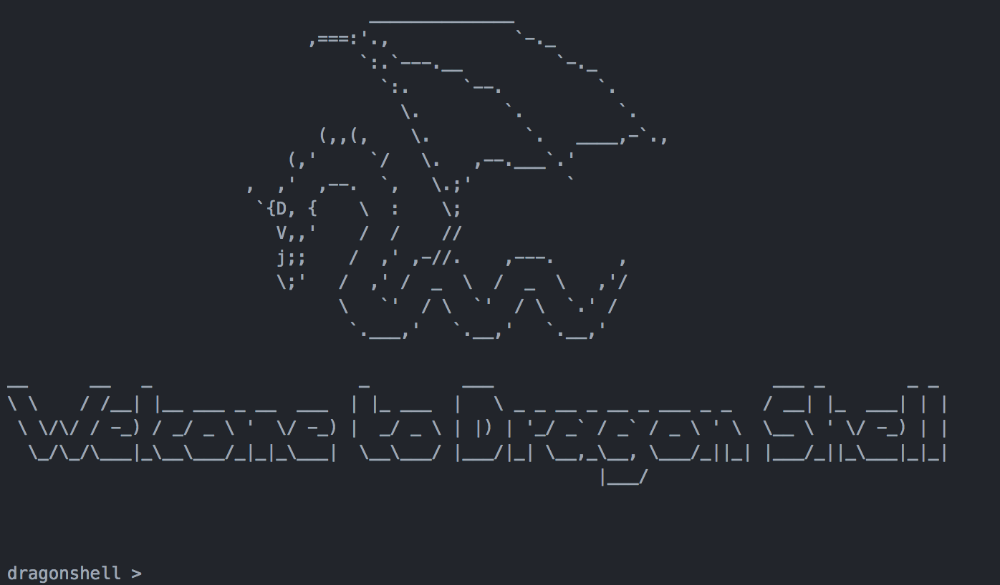

# DragonShell

### Project Description
Dragonshell is a procedurally designed interactive UNIX-based shell program

The following features are supported:
- Built in commands
    - cd for changing the present working directory
    - pwd for printing the present working directory
    - a2path for overwriting or appending an address to the path variable
    - exit for gracefully terminating the shell and all processes.

- Run an external program with the provided arguments when its absolute path is provided, or when the
program can be located in the path or in the present working directory.
- Run multiple commands written in a single line, separated by “;”
- Support background execution when an “&” is put at the end of the command line.
- Support redirecting the output from one program to a file.
- Support piping the output of one program to another program.
- Handle signals (Ctrl-C, Ctrl-Z, and Ctrl-D)

### System calls used
- getcwd(): get current directory
- chdir(): changing directories
- execve(): execute a process
- access(): check if file can be accessed
- dup2(): duplicate a file descriptor
- \_exit(): exit a process
- open(): open a file descriptor
- close(): close a file descriptor
- wait(): wait for child process
- pipe(): create a pipe between two processes
- fork(): create a subprocess
- kill(): kill a process
- sigaction(): for handling signals

### Testing implementation
- Running various commands individually and in combination with other commands.
- htop and pstree were also used to maintain subprocess construction and destruction.
